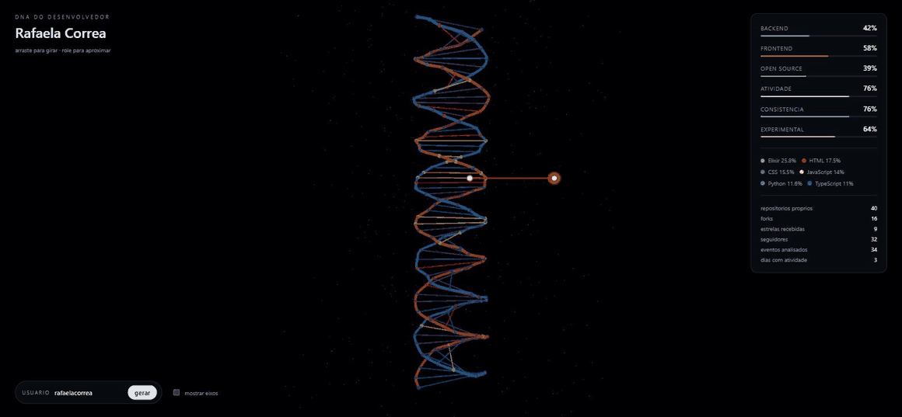
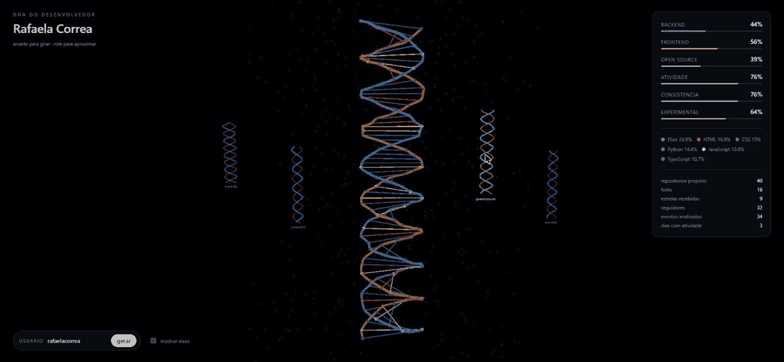

# DNA do Desenvolvedor

O perfil publico de alguem no GitHub transformado em uma helice 3D que da para
girar com o mouse. Nao e um dashboard e nao tem grafico: o algoritmo le os
repositorios e a atividade recente da pessoa, calcula seis tracos e usa esses
tracos para construir uma estrutura procedural unica.

Duas pessoas nunca geram a mesma helice. A mesma pessoa gera sempre a mesma.
E cada perfil gerado fica guardado: os anteriores ficam flutuando em um plano
atras do que esta em foco, e um clique traz qualquer um deles para o centro.

Todo o calculo e Python (evolucao do projeto
[github-user-activity](https://github.com/rafaelacorrea/github-user-activity)),
servido por uma API que a cena em Three.js consome. Digitou um usuario na tela,
o Python coleta no GitHub, calcula os tracos e devolve o JSON que vira a
helice - sem duplicar uma linha do algoritmo em JavaScript.

## Sumario

- [Demonstracao](#demonstracao)
- [A ideia](#a-ideia)
- [Como o perfil vira geometria](#como-o-perfil-vira-geometria)
- [A colecao de DNAs](#a-colecao-de-dnas)
- [Requisitos](#requisitos)
- [Como usar](#como-usar)
- [A API](#a-api)
- [O algoritmo](#o-algoritmo)
- [Formato do JSON](#formato-do-json)
- [Estrutura do projeto](#estrutura-do-projeto)
- [Arquitetura](#arquitetura)
- [Publicacao](#publicacao)
- [Testes](#testes)
- [Decisoes de implementacao](#decisoes-de-implementacao)
- [Licenca](#licenca)

## Demonstracao



A gravacao mostra o DNA de dois perfis reais: primeiro o giro livre da helice,
depois os eixos ligados e, no fim, a troca para outro usuario. Repare como a
estrutura muda por completo entre um perfil e outro.

## A ideia

Seis tracos, organizados em tres eixos de polos opostos:

```
                 OPEN SOURCE
                      |
                      |
       BACKEND -------+------- FRONTEND
                      |
                      |
                  ATIVIDADE

        CONSISTENCIA --+-- EXPERIMENTAL
             (eixo de profundidade)
```

Um perfil como

```
Backend       92%
Open Source   61%
Consistencia  74%
Experimental  88%
```

nao vira uma lista de barras: vira uma fita azul grossa, um halo medio de
particulas, degraus em ritmo regular e uma torcao acentuada. Os numeros
continuam la, no painel lateral, mas quem conta a historia e a forma.

## Como o perfil vira geometria

| Traco            | O que muda na cena                                                |
| ---------------- | ----------------------------------------------------------------- |
| **Atividade**    | Altura da estrutura e quantidade de pares de bases (34 a 80)      |
| **Frontend**     | Raio da helice: quanto mais frontend, mais aberta                 |
| **Backend**      | Espessura da fita azul; o frontend engrossa a fita laranja        |
| **Experimental** | Numero de voltas e o ruido aplicado a cada degrau                 |
| **Consistencia** | Regularidade do espacamento vertical entre os degraus             |
| **Open Source**  | Densidade do halo de particulas e o tamanho das bases             |

Alem disso, cada degrau recebe uma linguagem sorteada com o peso que ela tem no
perfil, usando a cor daquela linguagem. Uma pessoa que so escreve C tem uma
helice cinza uniforme; uma poliglota tem degraus de cores diferentes a cada
volta.

Nada disso e aleatorio de verdade. A semente do gerador vem de um hash do nome
de usuario, calculado em Python e gravado no JSON, entao o resultado e sempre o
mesmo em qualquer maquina.

## A colecao de DNAs



Cada vez que voce roda o CLI, o perfil e gravado em `public/dados/<usuario>.json` e
entra num indice, o `public/dados/index.json`. A cena le esse indice e monta uma
versao reduzida da helice de cada perfil ja conhecido - so as duas fitas, sem
degraus e sem particulas - alinhadas em um plano atras do DNA em foco.

Passar o mouse acende a estrutura e o nome. Clicar faz a camera voar ate ela,
troca o perfil em foco e devolve a camera para o enquadramento normal, com o
antigo indo ocupar o lugar vago la atras. Nada recarrega: e tudo a mesma cena.

O plano acompanha a camera. Como a cena gira sozinha, um plano fixo acabaria
passando na frente do DNA principal; girando junto, a galeria fica sempre
atras do que voce esta olhando.

Nao ha banco de dados nisso. A colecao sao os proprios arquivos JSON da pasta,
e o indice e reconstruido do zero a cada execucao do CLI, varrendo o que esta
la. Apagou um JSON na mao? Na proxima execucao ele some do indice sozinho.

As miniaturas sao simplificadas por um motivo pratico: uma helice completa
passa de duzentas malhas, e uma duzia delas na cena derrubaria a taxa de
quadros. Reduzida, cada uma tem duas.

## Requisitos

- Python 3.10 ou superior para o coletor.
- Um navegador com WebGL para a cena.
- Acesso a internet para falar com `https://api.github.com`.
- Nenhuma dependencia externa em Python: tudo vem da biblioteca padrao
  (`urllib`, `json`, `hashlib`, `math`, `statistics`, `colorsys`).
- No navegador, o Three.js e carregado do CDN jsDelivr, na versao 0.160.0.

## Como usar

```bash
python servidor.py
```

```
Cena em http://127.0.0.1:8000
API  em http://127.0.0.1:8000/api/dna/<usuario>
Sem token: cerca de 60 requisicoes por hora na API do GitHub.
Ctrl+C para encerrar.
```

Abra o endereco, digite qualquer usuario do GitHub no campo de baixo e pronto:
a API coleta, calcula e a helice aparece. Perfis ja coletados voltam na hora,
direto do arquivo, sem gastar requisicao.

Opcoes do servidor:

| Opcao        | O que faz                                                        |
| ------------ | ---------------------------------------------------------------- |
| `--porta`    | Porta de escuta (padrao: 8000)                                   |
| `--endereco` | Use `0.0.0.0` para aceitar acesso da rede local                  |
| `--token`    | Token do GitHub, para sair do limite de 60 requisicoes por hora  |

### Pelo terminal, sem abrir o navegador

O mesmo calculo tambem roda direto na linha de comando. E o jeito de
pre-gerar os perfis que vao commitados no repositorio, para a cena nao abrir
vazia em uma publicacao estatica.

#### Gerar o DNA

```bash
python dna_cli.py rafaelacorrea
```

```
DNA do desenvolvedor: rafaelacorrea

  Backend       [##########..............]  42%
  Frontend      [##############..........]  58%
  Open Source   [#########...............]  39%
  Atividade     [##################......]  76%
  Consistencia  [##################......]  76%
  Experimental  [###############.........]  64%

Linguagens: Elixir 25.8%, HTML 17.5%, CSS 15.5%, JavaScript 14.0%, Python 11.6%, TypeScript 11.0%

Base de calculo: 40 repositorios proprios, 16 forks, 9 estrelas, 34 eventos recentes em 3 dias distintos.
Semente da estrutura: 2530147054

Arquivo gravado em web\dados\rafaelacorrea.json
Indice atualizado em web\dados\index.json (5 perfis na colecao)
```

Opcoes:

| Opcao        | O que faz                                                       |
| ------------ | --------------------------------------------------------------- |
| `--saida`    | Grava o JSON em outro caminho (padrao: `public/dados/<usuario>.json`) |
| `--so-texto` | Apenas mostra o resultado no terminal, sem gravar arquivo        |
| `--token`    | Token do GitHub para aumentar o limite de requisicoes           |

Sem autenticacao, a API do GitHub permite cerca de 60 requisicoes por hora por
IP, e cada execucao gasta de tres a cinco. Com um token o limite sobe para 5000:

```bash
python dna_cli.py rafaelacorrea --token ghp_seu_token_aqui
```

```powershell
$env:GITHUB_TOKEN = "ghp_seu_token_aqui"
python dna_cli.py rafaelacorrea
```

#### Servir a cena sem a API

Se voce so quer olhar o que ja foi gerado, qualquer servidor de arquivos
resolve (os modulos JavaScript nao carregam a partir de `file://`):

```bash
python -m http.server --directory public 8000
```

Nesse modo o campo de busca so encontra quem ja tem arquivo: sem API, nao ha
como coletar. E o que acontece em qualquer hospedagem que sirva apenas
arquivos estaticos.

### Na tela

- **digitar um usuario** e apertar gerar coleta o perfil na hora;
- **arrastar** gira a estrutura;
- **rolar** aproxima e afasta;
- o campo **usuario** troca de perfil, contanto que o JSON dele ja tenha sido
  gerado;
- o interruptor **mostrar eixos** revela o diagrama dos tres eixos em 3D, com
  um marcador na posicao exata do perfil em cada um deles;
- as estruturas **no plano de tras** sao os DNAs ja gerados: passe o mouse para
  acender e clique para trazer aquele perfil ao centro.

Ja vem com cinco perfis prontos em `public/dados`: `rafaelacorrea`, `franknfjr`,
`gvanrossum`, `josevalim` e `torvalds` (util para ver um extremo: 100% backend
e 80% open source). Eles aparecem no plano de tras assim que a cena abre.

## A API

O `servidor.py` serve a cena e as rotas abaixo no mesmo endereco, usando so o
`http.server` da biblioteca padrao:

| Rota                             | O que devolve                                   |
| -------------------------------- | ----------------------------------------------- |
| `GET /api/dna/<usuario>`         | O DNA do usuario, do arquivo ou coletado na hora |
| `GET /api/dna/<usuario>?forcar=1`| Ignora o arquivo e coleta de novo                |
| `GET /api/indice`                | A lista dos DNAs ja gerados                      |

O cabecalho `X-Dna-Origem` diz de onde veio a resposta: `arquivo` quando o
perfil ja estava gravado, `github` quando foi coletado agora. Toda resposta da
API leva `X-Dna-Api: 1` - e assim que a cena distingue "esse usuario nao existe"
de "nao ha API neste endereco" e decide se cai nos arquivos estaticos.

Os erros chegam como JSON com uma mensagem em portugues e o codigo certo:
`404` para usuario inexistente, `429` para limite da API do GitHub atingido,
`502` quando o GitHub esta fora, `400` para nome de usuario invalido.

Dois cuidados que valem nota:

- **Nome validado antes de virar caminho.** O nome de usuario e conferido
  contra a regra do proprio GitHub. Alem de recusar entrada invalida cedo,
  isso impede que um `../..` escape da pasta de dados.
- **Um cadeado por usuario.** Se duas abas pedirem o mesmo perfil ao mesmo
  tempo, a segunda espera a primeira terminar e aproveita o arquivo recem
  gravado, em vez de gastar outra chamada na API do GitHub.

## O algoritmo

Todos os tracos vao de 0 a 100 e saem de tres chamadas a API publica: o perfil,
a lista de repositorios e os eventos recentes.

**Backend e Frontend.** Cada repositorio proprio entra com um peso de
`1 + log10(1 + tamanho)`, o que faz projetos grandes contarem mais sem que um
monorepo apague todo o resto. As linguagens sao classificadas em backend,
frontend ou outros (a lista esta em `dna/linguagens.py`), e os dois lados
dividem 100 pontos entre si. Forks nao contam: eles nao sao codigo da pessoa.

**Open Source.** Media ponderada de estrelas recebidas (35%), forks recebidos
(25%), seguidores (20%) e a fatia dos eventos recentes que aconteceram em
repositorios de outras pessoas (20%). As tres primeiras usam escala
logaritmica, entao sair de 0 para 10 estrelas vale muito mais do que sair de
1000 para 1010.

**Atividade.** Volume de eventos publicos recentes (60%) combinado com a
quantidade de repositorios que receberam push nos ultimos 90 dias (40%).

**Consistencia.** Mede ritmo, nao volume. Sessenta por cento vem da cobertura
(quantos dias do periodo observado tiveram alguma atividade) e quarenta por
cento da regularidade dos intervalos entre um dia ativo e outro. Quem trabalha
um pouco todo dia pontua alto; quem faz vinte commits em um sabado e some por
dois meses pontua baixo.

**Experimental.** Diversidade de linguagens medida pela entropia de Shannon
(50%), fatia de repositorios criados no ultimo ano (30%) e fatia de
repositorios pequenos, que costumam ser testes e provas de conceito (20%).

Vale dizer o que esses numeros nao sao: eles descrevem o que esta publico no
GitHub, nao a qualidade nem o tamanho do trabalho de ninguem. Codigo privado,
trabalho em outra plataforma e contribuicoes sem commit simplesmente nao
aparecem na API.

## Formato do JSON

```json
{
  "usuario": "rafaelacorrea",
  "nome": "Rafaela Correa",
  "gerado_em": "2026-09-09T23:31:00+00:00",
  "semente": 2530147054,
  "tracos": {
    "backend": 42,
    "frontend": 58,
    "open_source": 39,
    "atividade": 76,
    "consistencia": 76,
    "experimental": 64
  },
  "rotulos": { "backend": "Backend", "open_source": "Open Source" },
  "linguagens": [
    { "nome": "Elixir", "percentual": 25.8, "grupo": "backend", "cor": "#8c5ea1" }
  ],
  "estatisticas": {
    "repositorios_proprios": 40,
    "forks": 16,
    "estrelas_recebidas": 9,
    "seguidores": 32,
    "eventos_analisados": 34,
    "dias_ativos": 3
  }
}
```

O front-end nao recalcula nada: ele so desenha o que esta nesse arquivo. Isso
mantem o algoritmo em um lugar so.

## Estrutura do projeto

```
dna-do-desenvolvedor/
  vercel.json                Configuracao da hospedagem
  pyproject.toml             Metadados e o entrypoint da hospedagem
  api/
    dna.py                   A mesma API, no formato de funcao sem estado
  .github/workflows/
    testes.yml               Roda a suite a cada push
  servidor.py                Executavel: sobe a cena e a API juntas
  dna_cli.py                 Executavel: chama dna.cli.main
  dna/
    __init__.py              Exporta os componentes publicos do pacote
    api.py                   Servidor HTTP: rotas da API e arquivos da cena
    github.py                Chamadas a API publica do GitHub
    linguagens.py            Classificacao e cores das linguagens
    tracos.py                O algoritmo: perfil -> seis tracos
    cli.py                   Argumentos, resumo em texto e gravacao do JSON
  public/
    index.html               Pagina da cena
    estilo.css               Interface sobreposta
    js/
      principal.js           Montagem da cena, camera, bloom e interface
      helice.js              Construcao procedural da helice
      galeria.js             Os DNAs ja gerados no plano de fundo
      eixos.js               Diagrama dos tres eixos em 3D
      aleatorio.js           Gerador pseudoaleatorio com semente
      painel.js              Painel de tracos, linguagens e estatisticas
    dados/                   JSONs gerados pelo CLI, mais o index.json
  testes/
    test_tracos.py           Testes do algoritmo
    test_linguagens.py       Testes da classificacao e das cores
    test_github.py           Testes do cliente, com a API simulada
    test_api.py              Testes das rotas, com o servidor no ar
    test_funcao.py           Testes do roteamento da funcao na nuvem
    test_cli.py              Testes da linha de comando
  docs/
    demonstracao.gif         Demonstracao usada no README
    galeria.gif              A troca de perfil pela galeria
  .gitignore
  README.md
```

## Arquitetura

```
                        api.github.com
                              ^
                              |
  servidor.py -> dna/api.py -> dna/github.py
  dna_cli.py  -> dna/cli.py ->
                     |
                dna/tracos.py -> dna/linguagens.py
                     |
                     v
            public/dados/<usuario>.json + index.json
                     |
                     v
    web/js/principal.js -> helice.js -> aleatorio.js
                        -> galeria.js
                        -> eixos.js
                        -> painel.js
```

O ponto importante e a fronteira do JSON. Tudo que e decisao (o que conta como
backend, quanto vale uma estrela, o que e ser consistente) fica em Python, com
testes. Tudo que e desenho fica em JavaScript. A cena nunca chama a API do
GitHub e nunca recalcula um traco - ela pede pronto.

A linha de comando e a API sao duas portas para o mesmo miolo: as duas chamam
`dna.tracos.calcular` e gravam com `dna.cli.gravar`. Trocar uma formula muda o
comportamento das duas de uma vez.

`dna/github.py` nasceu do cliente escrito no projeto `github-user-activity`.
Ele ganhou aqui a busca de perfil e a de repositorios com paginacao, mas manteve
a mesma estrutura: so `urllib`, e cada falha HTTP virando uma excecao com
mensagem em portugues.

## Publicacao

O site esta no ar em **https://dna.rafaelacorrea.dev**, hospedado na Vercel.
A escolha nao foi por gosto: o GitHub Pages so entrega arquivos, e este
projeto precisa de Python rodando para coletar um usuario que ninguem gerou
antes.

A hospedagem acompanha o repositorio: cada commit na `main` vira um deploy,
sem workflow de publicacao. O `.github/workflows/testes.yml` roda a suite a
cada push, so para marcar no GitHub quando algo quebra.

### Como esta montado

```
vercel.json
  pasta public/              a cena, servida como arquivo estatico
  functions: api/dna.py       a coleta, rodando em Python
  rewrites:
    /api/dna/:usuario   ->  /api/dna?usuario=:usuario

pyproject.toml
  [tool.vercel] entrypoint    qual objeto atende as requisicoes
```

O runtime Python da hospedagem trabalha com um entrypoint unico, e nao com um
arquivo por rota. Por isso a funcao decide sozinha o que fazer a partir do
caminho recebido: `/api/dna` coleta, `/api/indice` devolve a colecao
commitada, qualquer outro vira 404 em JSON. Ela tambem aceita o nome do
usuario no proprio caminho, para o caso de o rewrite nao ser aplicado.

O `api/dna.py` e uma casca fina: ele monta o `ServicoDeDna` e chama o mesmo
`dna.api.responder` que o servidor local usa. As regras continuam existindo
uma vez so.

### Duas diferencas em relacao ao servidor local

**Nao grava nada.** O disco de uma funcao sem estado e somente leitura, entao
o servico roda com `gravar_resultado=False`: o resultado fica no cache em
memoria, que dura enquanto a instancia estiver quente, e os perfis
versionados em `public/dados` seguem sendo lidos normalmente. Na pratica, a
galeria de fundo e a colecao commitada, e qualquer usuario digitado e
calculado na hora.

**O token vem do ambiente.** Em `Settings -> Environment Variables` da
hospedagem, `GITHUB_TOKEN` com um token de leitura publica. Isso leva o limite
de 60 para 5000 requisicoes por hora, e o token nunca chega ao navegador -
quem chama a API do GitHub e o Python, no servidor.

### Dominio

Um registro `CNAME` de `dna` apontando para o endereco que a Vercel indica no
painel do projeto, e o dominio cadastrado la em `Settings -> Domains`. O
dominio principal continua onde estiver: subdominio nao conflita com o apex.

### Analytics

A pagina carrega o Plausible do dominio principal com o script manual:

```html
<script defer data-domain="rafaelacorrea.dev"
        src="https://plausible.io/js/script.manual.js"></script>
<script>
  plausible("pageview", { u: "https://rafaelacorrea.dev/dna" });
</script>
```

Assim a visita cai no painel que ja existe, aparecendo como `/dna` em vez de
mais um `/` misturado com a home. Nenhum site novo precisa ser criado no
Plausible.

### Rodando na sua maquina

```bash
python servidor.py
```

Ai sim tudo e gravado: cada perfil coletado vira arquivo em `public/dados` e
entra no indice. E assim que a colecao commitada cresce.

## Testes

A suite usa `unittest`, da biblioteca padrao. Nenhum teste acessa a internet:
as respostas HTTP sao simuladas com `unittest.mock`.

```bash
python -m unittest discover -s testes -t .
```

Sao 90 testes cobrindo as normalizacoes, cada um dos seis tracos, a
estabilidade da semente, a classificacao e as cores das linguagens, a paginacao
do cliente, todos os caminhos de erro da API do GitHub, a montagem do indice, a
linha de comando, as rotas HTTP, o roteamento da funcao
na nuvem e o modo somente leitura.

Os testes da API sobem o servidor de verdade em uma porta livre e conversam com
ele por `urllib`, com o cliente do GitHub simulado. O que esta sendo verificado
e o comportamento real das rotas: codigos de situacao, cabecalhos e o que fica
gravado em disco.

## Decisoes de implementacao

- **O algoritmo mora em um lugar so.** A pagina poderia chamar a API do
  GitHub direto do navegador, mas ai a formula existiria duas vezes, em Python
  e em JavaScript, e qualquer ajuste teria que ser feito nos dois lugares. Uma
  API em Python resolve o mesmo problema mantendo uma implementacao so.
- **A API usa `http.server`.** Um Flask ou FastAPI daria mais conforto, mas
  traria a primeira dependencia externa do projeto para servir tres rotas de
  leitura. A biblioteca padrao da conta.
- **Semente derivada do nome.** Uma estrutura procedural que muda a cada
  recarga seria bonita e inutil: nao daria para reconhecer o proprio DNA. O
  hash do nome de usuario garante o oposto.
- **Escalas logaritmicas.** Sem elas, um unico projeto com dez mil estrelas
  levaria qualquer perfil a 100% em open source e achataria todo mundo em zero.
- **Tres eixos, seis polos.** Backend e frontend sao dois lados da mesma
  medida, entao dividem 100 pontos. Ja consistencia e experimental sao
  independentes: da para ser as duas coisas ao mesmo tempo, e o eixo serve
  apenas como referencia visual.
- **Sem banco de dados.** A colecao de perfis sao os arquivos JSON, e o
  indice e derivado deles. Um banco daria um estado a mais para manter em dia
  sem resolver nenhum problema que a pasta ja nao resolva - e o site e
  estatico, entao ele nunca poderia ler esse banco de qualquer forma.
- **Sem emoji e sem framework.** Nem no codigo, nem na interface, nem nos
  commits. A cena e Three.js puro, sem bundler e sem etapa de build.

## Licenca

Distribuido sob a licenca MIT. Veja o arquivo [LICENSE](LICENSE).
